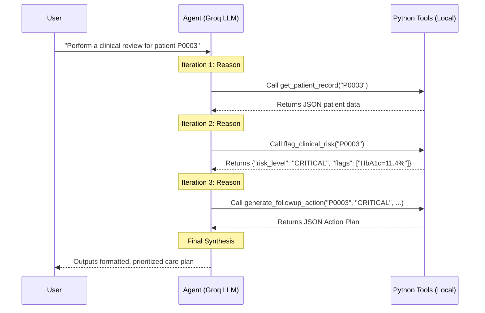

# MediCare Patient Follow-Up Agent: Workflow & Architecture

## 1. Problem Statement

**The Challenge:**
MediCare Clinic manages over 1,000 patients suffering from chronic diseases (such as Type 2 Diabetes, Hypertension, Heart Failure, COPD, and Anemia). The care coordination teams are overwhelmed by the sheer volume of data and struggle to manually identify which patients require immediate medical intervention.

**What We Are Solving:**
The clinic needs an **autonomous, AI-powered clinical decision-support agent** capable of:
1. Autonomously retrieving and reviewing patient records, lab results, and vitals.
2. Identifying patients at elevated clinical risk (e.g., severe hypertension, critical lab values, or missed appointments).
3. Automatically generating prioritized, structured follow-up care action plans so the medical staff knows exactly *who to contact first* and *what action to take*.

---
h
## 2. Solution Architecture

We implemented a **Tool-Calling Agent** utilizing the **ReAct** (Reason + Act) framework, powered by the **Groq API** (using the `openai/gpt-oss-120b` model for high-speed inference).

### The Agent's Toolkit
The LLM does not hallucinate medical diagnoses. Instead, it acts as an intelligent orchestrator provided with **4 deterministic Python tools** it can call to interact safely with the clinic's data:

1. **`get_patient_record(patient_id)`** 
   Retrieves the patient's demographics, diagnoses, and raw lab/vital data from the database (CSV).
2. **`flag_clinical_risk(patient_id)`** 
   Evaluates raw data against hardcoded, evidence-based medical thresholds to flag the patient as `LOW`, `HIGH`, or `CRITICAL` risk (e.g., an HbA1c >= 10% triggers a CRITICAL flag).
3. **`generate_followup_action(patient_id, risk_level, flags)`** 
   Maps the calculated risk level to a concrete action plan (e.g., "Emergency outreach within 24 hours" vs. "Routine monitoring").
4. **`get_missed_appointment_patients()`** 
   Retrieves a bulk list of all patients who missed their last scheduled visit, allowing the agent to prioritize proactive outreach.

---

## 3. The Agentic Workflow (How it Flows)

When a user prompts the system (e.g., *"Perform a complete clinical review for patient P0003"*), the agent enters an autonomous loop of reasoning and acting.

### Why this Architecture Works:
* **Clinical Safety First:** The LLM does *not* invent medical rules. The `flag_clinical_risk` tool enforces strict, programmatic medical guidelines. The LLM simply acts as the orchestrator.
* **Auditability:** Because every step is a discrete tool call (retrieving data -> checking risk -> generating plan), clinical staff can trace the exact logic and data points that led the agent to recommend a specific action.
* **Extensibility:** If MediCare wants to add a new feature (like checking for drug-drug interactions), we simply write a 5th tool and pass its schema to the LLM. The core ReAct loop remains completely untouched.
